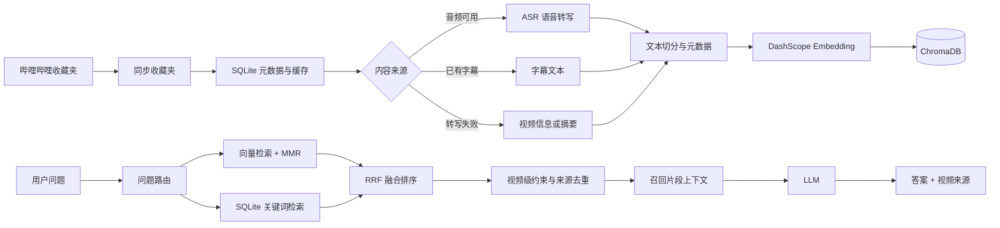

# BiliRAG

## 把视频收藏夹变成可追溯的个人知识库

BiliRAG 是一个面向个人学习资料的 B 站收藏夹知识库。它把收藏夹中的视频同步到本地，获取字幕或语音转写内容，切分为可检索的文本片段，再通过混合检索为问答模型提供相关上下文。

回答不只给出一段生成文本，还会返回命中的视频标题、BV 号和原视频链接，方便回到原始内容核对。


## 项目解决什么问题

收藏夹适合保存内容，却不适合回答问题：视频多、标题粒度粗，想找某个观点时往往需要重新打开多个视频并手动定位。

这个项目把流程拆成两部分：

- **入库**：收藏夹同步 → 内容获取 → 文本切分 → 向量化 → 本地索引
- **问答**：问题路由 → 向量与关键词召回 → RRF 融合 → MMR 多样性选择 → LLM 生成答案与来源

## 系统链路



## 核心实现

### 1. 收藏夹同步

用户通过 B 站扫码登录后，后端使用会话中的 Cookie 获取收藏夹和视频列表。同步结果写入 SQLite：

| 表 | 作用 |
| --- | --- |
| `user_sessions` | 保存登录会话及 B 站用户标识 |
| `favorite_folders` | 保存收藏夹、标题、数量和最近同步时间 |
| `favorite_videos` | 保存收藏夹与视频 BV 号的关联 |
| `video_cache` | 缓存视频标题、简介、UP 主、转写文本和处理状态 |

同步过程按 BV 号去重，并比较收藏夹当前列表与本地记录，新增视频进入处理队列，已经移除的视频会从对应收藏关系中清理。

### 2. 视频内容获取

`ContentFetcher` 按可用性选择内容来源：

1. 尝试获取视频音频并调用 ASR 转写；
2. 音频直链不可用时，使用带 Cookie 的本地下载和 `ffmpeg` 转码后再识别；
3. 多 P 视频逐 P 处理，并合并每一 P 的文本；
4. 转写不可用时尝试字幕或视频摘要；
5. 最后保留标题、简介等基本信息，保证视频状态和失败原因可见。

内容来源会记录为 `asr`、`subtitle`、`ai_summary` 或 `basic_info`，因此可以区分“有完整转写”和“只有基本信息”的视频。

### 3. 文本切分与向量索引

入库时，`RAGService.add_video_content()` 使用 `RecursiveCharacterTextSplitter` 处理文本：

- `chunk_size=1000`
- `chunk_overlap=200`
- 优先按照段落、换行和中英文句号切分

每个文本块都会带上以下元数据：

```text
bvid          视频 BV 号
title         视频标题
source        内容来源
doc_type      chunk 或 metadata
chunk_index   片段序号
url           原视频地址
```

除了正文片段，系统还会额外写入一条 `metadata` 文档，包含标题、简介、UP 主、时长和内容提纲，用来提升“哪个视频讲了某主题”这类问题的召回率。向量由 DashScope Embedding 生成，持久化到 ChromaDB。

### 4. 混合检索、RRF 与多样性控制

普通问答默认并发执行两路召回：

- **向量检索**：使用 Chroma 的 MMR，从语义相近的候选片段中兼顾相关性和差异性；
- **关键词检索**：从问题中去除常见疑问词，提取英文、数字和中文片段，在 SQLite 的标题、简介、正文和 UP 主字段中做匹配。

关键词检索不依赖额外分词器。中文长句会生成 4、3、2 字符的 n-gram；标题命中权重最高，正文命中权重最低。两路结果通过加权 Reciprocal Rank Fusion 合并：

```text
RRF(d) = 1 / (60 + 向量检索排名) + 0.9 / (60 + 关键词检索排名)
```

融合后默认保留 8 个结果，并限制同一视频最多占 2 个片段；这样既不会丢掉语义相关内容，也能避免最终上下文被某一个长视频全部占满。

### 5. 送给 LLM 的到底是什么

对于普通知识问答，LLM 接收到的是**召回到的 `Document.page_content` 文本片段**，不是整部视频的全部文字。每个片段前会附带视频标题，多个片段之间用分隔线连接。

系统同时从 `Document.metadata` 中提取 `bvid`、标题和 URL，作为回答后的来源列表返回。因此“回答上下文”和“可追溯来源”是两套信息：前者用于生成答案，后者用于让用户回到视频核对。

列表类问题和总结类问题会走专门的数据库读取路径：列表问题读取收藏夹视频清单；总结问题读取已缓存的视频内容。这两类问题不是简单地把整部视频塞进普通 RAG 上下文，而是由路由逻辑决定读取范围。

## 主要能力

- B 站扫码登录和会话管理
- 收藏夹列表、视频列表和增量同步
- 多 P 视频处理、ASR、字幕与基本信息兜底
- SQLite 缓存 + ChromaDB 向量索引
- 向量检索、关键词检索、RRF 融合和 MMR
- 视频级去重、来源链接和检索片段预览
- 普通问答与流式问答
- 视频原始内容或 AI 整理结果导出为 Markdown
- 单视频重新入库、删除视频和取消正在执行的操作

## 技术栈

| 层次 | 技术 |
| --- | --- |
| 前端 | Next.js、React、Tailwind CSS |
| API | FastAPI、Uvicorn |
| 数据库 | SQLite、SQLAlchemy、aiosqlite |
| RAG | LangChain、ChromaDB、DashScope Embedding |
| 模型服务 | OpenAI 兼容聊天接口、DashScope ASR |
| 媒体处理 | ffmpeg |
| 部署 | Docker Compose |

## 本地运行

### Docker Compose（推荐）

需要先安装 Docker Desktop，并准备一个可用的 DashScope 或 OpenAI 兼容 API Key。

```powershell
Copy-Item .env.example .env
# 编辑 .env，填写 DASHSCOPE_API_KEY 或 OPENAI_API_KEY
docker compose up -d --build
docker compose ps
```

启动后访问：

- 页面：<http://localhost:3000>
- API 文档：<http://localhost:8000/docs>
- 健康检查：<http://localhost:8000/health>

查看日志：

```powershell
docker compose logs --tail 100 -f
```

停止服务：

```powershell
docker compose down
```

`data/` 和 `logs/` 通过 Compose 挂载到宿主机，停止容器不会删除本地数据库和向量库。

### 手动启动

后端需要 Python 3.11、`ffmpeg` 和 Node.js 环境：

```powershell
pip install -r requirements.txt
Copy-Item .env.example .env
python -m uvicorn app.main:app --reload
```

另开一个终端启动前端：

```powershell
Set-Location frontend
npm install
npm run dev
```

## 配置重点

`.env` 位于项目根目录，不要提交真实密钥。常用配置如下：

```env
DASHSCOPE_API_KEY=你的百炼APIKey
OPENAI_BASE_URL=https://dashscope.aliyuncs.com/compatible-mode/v1
LLM_MODEL=qwen3-max
EMBEDDING_MODEL=text-embedding-v4
CHAT_USE_LLM_ROUTER=false

RETRIEVAL_CANDIDATE_K=24
RETRIEVAL_TOP_K=8
RETRIEVAL_MMR_FETCH_K=32
RETRIEVAL_MMR_LAMBDA=0.55
```

修改模型或密钥后需要重新创建后端容器：

```powershell
docker compose up -d --force-recreate backend
```

聊天接口使用 `OPENAI_BASE_URL` 指向的兼容接口；Embedding 和 ASR 使用 DashScope 自己的接口配置。两者不要混用。

## API 入口

| 方法 | 路径 | 作用 |
| --- | --- | --- |
| `GET` | `/auth/qrcode` | 获取登录二维码 |
| `GET` | `/favorites/list` | 获取收藏夹列表 |
| `GET` | `/favorites/{media_id}/videos` | 获取收藏夹视频 |
| `POST` | `/knowledge/folders/sync` | 同步收藏夹 |
| `POST` | `/knowledge/build` | 后台构建知识库 |
| `GET` | `/knowledge/build/status/{task_id}` | 查询构建进度 |
| `POST` | `/chat/ask` | 非流式问答 |
| `POST` | `/chat/ask/stream` | 流式问答 |
| `POST` | `/chat/search` | 直接检索片段 |
| `GET` | `/knowledge/stats` | 查看向量库统计 |

完整参数和响应格式以 `/docs` 中的 OpenAPI 文档为准。

## 目录结构

```text
.
├── app/
│   ├── routers/          # 登录、收藏夹、知识库、问答接口
│   ├── services/         # B 站访问、内容获取、ASR、RAG、检索
│   ├── models.py         # SQLite 模型与 API 数据模型
│   ├── database.py       # 异步数据库初始化与会话
│   └── main.py           # FastAPI 应用入口
├── frontend/             # Next.js 前端
├── data/                 # SQLite 与 ChromaDB 持久化目录
├── logs/                 # 后端日志
├── test/                 # 检索、数据库和接口测试
├── docker-compose.yml
├── Dockerfile
└── requirements.txt
```

## 测试与排查

```powershell
pytest -q
```

如果页面能打开但没有内容，先检查：

1. `/health` 是否返回 `{"status":"healthy"}`；
2. 是否完成 B 站扫码登录；
3. 是否选择收藏夹并完成入库；
4. 后端日志中是否存在 ASR、API Key 或向量写入错误；
5. 本机或容器内是否安装了 `ffmpeg`。

## 使用边界

- 本项目只保存用户有权访问的内容索引和本地缓存，不替代 B 站播放器或内容授权。
- B 站接口、音频地址和字幕权限可能变化，某些视频无法转写时会进入兜底状态。
- ASR、Embedding 和 LLM 调用可能产生费用，建议先用短视频验证配置。
- 当前会话 Cookie 写入本地 SQLite，部署到多人环境前应补充加密存储、权限控制和更严格的 CORS 配置。

## License

本项目使用 [Apache-2.0](LICENSE) 许可证。第三方视频、音频、字幕及其衍生内容的权利仍归原权利人所有。
