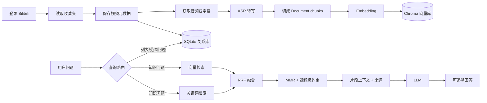
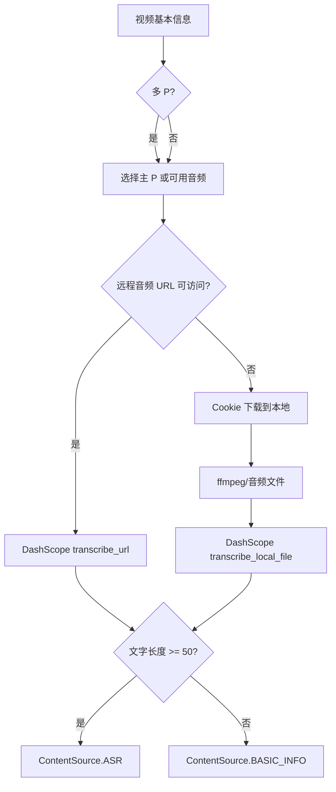

# BiliRAG 项目深度讲解

> 本文面向“会写 Python，但对 RAG、向量数据库、检索算法和异步 Web 服务还不熟”的读者。目标不是只解释名词，而是把仓库里的真实代码、数据流和设计取舍串起来：一个请求从哪里进来，数据如何保存，为什么要切片，检索结果如何融合，最后 LLM 到底拿到了什么。

## 1. 先用一句话理解整个项目

BiliRAG 把 Bilibili 收藏夹中的视频转成个人知识库。它先同步收藏夹元数据，再把视频内容转成文字，按语义切成许多小段，给每段文字生成向量并写入 Chroma；用户提问时，同时做向量检索和关键词检索，把两路结果用 RRF 合并，再用 MMR 和视频级约束去除重复，最后只把命中的文本片段和视频来源交给大模型回答。

可以把它看成一条“资料入库—建立索引—查询—生成答案”的流水线：



项目中有两个“真相来源”：SQLite 负责业务状态和关系，Chroma 负责文本片段的语义检索。两者不能互相替代。SQLite 知道“这个用户收藏了哪些视频、同步是否成功、视频标题是什么”；Chroma 擅长回答“哪些文字片段和问题意思最相近”。

## 2. 从目录开始：源码地图

后端的主要目录如下：

```text
app/
├─ main.py                    # FastAPI 应用、生命周期、路由装配
├─ config.py                  # 环境变量和 Settings
├─ database.py                # Async SQLAlchemy、SQLite 连接和建表
├─ models.py                  # ORM 表和 Pydantic 请求/响应模型
├─ routers/
│  ├─ auth.py                 # Bilibili 二维码登录和会话
│  ├─ favorites.py            # 收藏夹查看、视频列表和整理
│  ├─ knowledge.py            # 同步、知识库构建、导出、取消
│  └─ chat.py                # 普通问答和流式问答
└─ services/
   ├─ bilibili.py             # Bilibili HTTP API
   ├─ wbi.py                  # Bilibili WBI 签名
   ├─ content_fetcher.py      # 内容获取和转写策略
   ├─ asr.py                  # DashScope 语音识别
   ├─ rag.py                  # 切片、Embedding、Chroma
   ├─ retrieval.py            # 关键词检索、RRF、片段摘要
   ├─ markdown_export.py      # 原文/AI 整理后的 Markdown
   └─ cancellation.py         # 长任务取消标记
```

前端在 `frontend/`：

```text
frontend/
├─ app/page.tsx               # 页面组合和登录状态
├─ components/
│  ├─ SourcesPanel.tsx        # 收藏夹、同步、构建、来源
│  ├─ ChatPanel.tsx           # 问答、流式事件、执行轨迹
│  ├─ LoginModal.tsx          # 二维码登录
│  ├─ ExportMarkdownModal.tsx # Markdown 导出
│  └─ OrganizePreviewModal.tsx# AI 整理预览
└─ lib/api.ts                 # 前端 API 封装
```

## 3. 应用如何启动

### 3.1 FastAPI 生命周期

`app/main.py` 用 FastAPI 的 lifespan 管理启动和关闭：启动时初始化数据库，关闭时释放异步数据库引擎。入口代码的逻辑可以概括为：

```python
@asynccontextmanager
async def lifespan(app: FastAPI):
    await init_db()
    yield
    await close_db()

app = FastAPI(lifespan=lifespan)
app.include_router(auth.router, prefix="/api/auth")
app.include_router(favorites.router, prefix="/api/favorites")
app.include_router(knowledge.router, prefix="/api/knowledge")
app.include_router(chat.router, prefix="/api/chat")
```

这里的 `yield` 把生命周期分成两部分：`yield` 之前是启动阶段，之后是服务停止时的清理阶段。这样比在模块导入时直接连接数据库更可靠，因为测试和 ASGI 服务器都能明确控制资源的创建和销毁。

### 3.2 配置对象

`app/config.py` 使用 Pydantic Settings，把 `.env` 和环境变量转换成有类型的配置对象：

```python
class Settings(BaseSettings):
    database_url: str = "sqlite+aiosqlite:///./data/bilibili.db"
    chroma_persist_dir: str = "./data/chroma"
    dashscope_api_key: str = ""
    chat_model: str = "qwen-plus"
    embedding_model: str = "text-embedding-v3"
    rag_chunk_size: int = 1000
    rag_chunk_overlap: int = 200
    rag_mmr_lambda: float = 0.7

    model_config = SettingsConfigDict(env_file=".env", extra="ignore")
```

这段代码的工程价值在于：算法参数和密钥不散落在业务代码里。部署时可以替换环境变量，测试时也可以传入临时目录；`extra="ignore"` 允许 `.env` 中存在某些当前版本没有使用的字段，不会因为多余配置导致启动失败。

### 3.3 SQLite 的 WAL 和 busy timeout

`app/database.py` 创建异步 SQLite 引擎后，会通过连接事件执行：

```python
await db.execute(text("PRAGMA journal_mode=WAL"))
await db.execute(text("PRAGMA busy_timeout=30000"))
```

WAL（Write-Ahead Logging）允许读操作和写操作更好地并发；`busy_timeout=30000` 表示遇到短暂锁冲突时等待最多 30 秒，而不是立刻抛出 “database is locked”。这对“后台正在同步，前端同时轮询进度”的场景很重要。

## 4. 数据模型：为什么需要四张表

`app/models.py` 的关系模型可以理解为：

```text
UserSession 1 ─── N FavoriteFolder N ─── N FavoriteVideo
                                      \
                                       VideoCache
```

实际实现中，收藏夹和视频的多对多关系通过关联表保存。核心对象分别是：

### 4.1 `UserSession`

保存 Bilibili 登录后的 `mid`、昵称、Cookie 和二维码登录状态。Cookie 是访问收藏夹接口所必需的敏感凭据，因此不能只存在浏览器内存中；项目同时提供了内存优先、数据库兜底的读取方式。

### 4.2 `FavoriteFolder`

表示一个收藏夹，包含 Bilibili 的文件夹 ID、标题、视频数量和所属用户。用户 ID 必须参与查询条件，这是权限边界：同一个 BVID 可能被不同用户收藏，但用户 A 不能因为知道 BVID 就读取用户 B 的收藏范围。

### 4.3 `FavoriteVideo`

这是收藏夹和视频之间的关系记录。一个视频可以属于多个收藏夹，所以不能简单把 `folder_id` 放在视频表中。删除某个收藏夹中的视频关系时，只有当这个视频已经不属于任何收藏夹，系统才会考虑从知识库中删除它。

### 4.4 `VideoCache`

缓存视频的标题、作者、简介、时长、封面、转写文本、内容来源、抓取时间和失败信息。缓存的作用有两个：避免每次问答都重新访问 Bilibili；即使转写失败，也能把失败原因呈现给用户，而不是悄悄返回“没有结果”。

## 5. 登录链路：二维码如何变成可用 Cookie

`app/routers/auth.py` 把 Bilibili 的扫码登录封装成三个阶段：

1. `/qr` 请求二维码 URL 和二维码图片。
2. 前端定时调用 `/qr/poll`。
3. 当状态码为成功时，后端解析 Cookie，写入 `UserSession`。

Bilibili 的轮询状态大致是：`86101` 表示未扫码，`86090` 表示已扫码但未确认，`86038` 表示二维码过期，`0` 表示登录成功。后端不能把所有非 0 都当成失败，否则用户已经扫码但还没确认时，前端会错误地停止轮询。

成功后，服务会从响应中提取 `SESSDATA`、`bili_jct`、`DedeUserID` 等 Cookie，并根据 `DedeUserID` 确定用户的 `mid`。之后所有收藏夹请求都通过这个会话发送。

## 6. Bilibili API 和 WBI 签名

### 6.1 分页同步

`app/services/bilibili.py` 使用 `httpx.AsyncClient` 请求 Bilibili 接口。收藏夹接口不是一次返回全部视频，而是每页约 20 条，代码会持续请求下一页，直到 `has_more` 为假。每页之间保留短暂延迟，减少触发平台限流的概率。

因此，“同步收藏夹”不是一个简单的单次 HTTP 请求，而是：

```python
page = 1
while True:
    result = await get_favorite_page(folder_id, page)
    videos.extend(result.items)
    if not result.has_more:
        break
    page += 1
    await asyncio.sleep(0.3)
```

### 6.2 WBI 签名的核心思想

部分 Bilibili 接口需要 WBI 签名。项目的 `wbi.py` 会：

1. 请求导航接口获得 `img_url` 和 `sub_url`。
2. 取出两个文件名中的 key。
3. 按官方混淆表重排字符。
4. 加入当前时间戳 `wts`。
5. 对参数按 key 排序并 URL 编码。
6. 对 `query + mixin_key` 做 MD5，得到 `w_rid`。

伪代码如下：

```python
def enc_wbi(params, img_key, sub_key):
    mixin_key = get_mixin_key(img_key + sub_key)
    params = {**params, "wts": int(time.time())}
    query = urlencode(sorted(params.items()))
    params["w_rid"] = md5((query + mixin_key).encode()).hexdigest()
    return params
```

这里的 `wts` 不是随机数，而是当前 Unix 时间戳；服务器会用它判断签名是否过期。参数排序非常关键：客户端和服务端必须对完全相同的字符串签名，否则即使参数内容一样，MD5 结果也不同。

## 7. 从收藏夹到知识库：真正的同步主流程

知识库构建的主要入口在 `app/routers/knowledge.py` 的 `_sync_folder`。它不是“先下载全部，最后统一保存”，而是边同步、边提交、边更新进度。核心步骤如下。

### 7.1 第一步：拉取远端完整列表

系统先从 Bilibili 拉取收藏夹全量视频，建立远端 BVID 集合：

```python
remote_by_bvid = {item.bvid: item for item in remote_items}
remote_ids = set(remote_by_bvid)
```

然后读取本地 `FavoriteVideo` 关系，计算差集：

```python
added = remote_ids - local_ids
removed = local_ids - remote_ids
```

集合差集比逐条嵌套比较更清晰，复杂度接近 O(n)。

### 7.2 第二步：去重和无效项过滤

Bilibili 返回的数据中可能出现已失效、被删除或缺少 BVID 的项目。代码会先丢弃无法定位的视频，再按 BVID 去重，避免同一个视频被重复入库。

### 7.3 第三步：先保存元数据

新视频会先写入 `VideoCache` 和收藏夹关系，并在外部网络调用前提交一次数据库事务。这样即使后续音频下载或 ASR 失败，用户仍然能看到“这个视频已同步，但内容处理失败”。这是一种故障可见性设计。

### 7.4 第四步：内容刷新策略

如果缓存中已有成功转写且没有过期，系统可以复用它；如果用户强制刷新、缓存过期或上次只得到基本信息，才重新抓取内容。刷新策略避免了每次点击“构建知识库”都重复消耗 ASR 额度。

### 7.5 第五步：处理每个视频

单个视频的逻辑可以抽象成：

```python
for video in videos_to_process:
    if await cancellation.is_cancelled(task_id):
        break
    try:
        content = await content_fetcher.fetch_content(video)
        await save_cache(video, content)
        await rag.delete_video(video.bvid)
        if content.text:
            await rag.add_video(video, content.text)
        await db.commit()
    except Exception as exc:
        await save_failure(video, exc)
        await db.commit()
```

注意每个视频都单独提交。一个视频失败，不会让已经成功的几十个视频全部回滚，也不会让用户只能看到一个笼统的“构建失败”。

### 7.6 第六步：删除关系和向量

远端收藏夹中消失的视频会删除本地关系；只有确认该视频不再属于用户的任何收藏夹，才删除它的缓存和 Chroma 文档。这避免了“视频仍在收藏夹 B 中，却因为从收藏夹 A 消失而被误删”的问题。

### 7.7 第七步：任务状态和重复请求

构建接口会返回一个 `task_id`，后台任务保存于内存 `build_tasks`。相同用户、相同范围的重复构建会复用正在运行的任务；冲突范围会返回 409，避免两个任务同时删除和写入同一批向量。

### 7.8 第八步：状态校准

`/knowledge/folders/status` 不只看数据库的布尔字段，还会检查 Chroma 中实际是否存在对应 BVID 的文档。如果 SQLite 说“已完成”，但向量库中找不到文档，状态接口会把它重新标记为需要构建。这是对“双存储一致性”的补偿机制。

## 8. 视频内容获取：当前真实路径和备用代码

这是读源码时最容易误解的部分。仓库里有多种内容来源函数，但当前 `ContentFetcher.fetch_content()` 的主路径是“ASR 优先，基本信息兜底”。AI 摘要和字幕函数虽然存在，当前版本没有从主流程直接调用；它们属于预留能力，不能在面试中说成已经默认接入。

### 8.1 当前主路径

当前逻辑可以画成：



对应的简化代码如下：

```python
async def fetch_content(self, video: VideoInfo) -> ContentResult:
    info = await self.bilibili.get_video_info(video.bvid)
    audio_url = await self._get_audio_url(info)

    if audio_url and await self._probe_url(audio_url):
        text = await self.asr.transcribe_url(audio_url)
    else:
        local_path = await self._download_with_cookie(video, info)
        text = await self.asr.transcribe_local_file(local_path)

    if text and len(text.strip()) >= 50:
        return ContentResult(text=text, source=ContentSource.ASR)

    return ContentResult(
        text=self._build_basic_info(info),
        source=ContentSource.BASIC_INFO,
    )
```

“远程 URL 可访问”这个判断非常有必要。Bilibili 的音频地址经常带有临时签名、Referer 限制或过期时间；直接把 URL 交给转写服务可能失败，所以代码先做探测，失败后再带 Cookie 下载。

### 8.2 多 P 视频

一个视频可能有多个分 P。系统会读取页面信息和播放器信息，尽量定位可以直接提取音频的主分 P。这样知识库中的内容仍然以一个 BVID 归档，但转写内容可能是某个具体分 P 的音频。

### 8.3 ASR 服务

`app/services/asr.py` 将音频识别封装为两个接口：

```python
await asr.transcribe_url(audio_url)
await asr.transcribe_local_file(path)
```

两者最终都调用 DashScope 的模型，但输入媒介不同。服务层返回纯文本，路由层不需要知道请求体格式、轮询状态或临时文件细节，从而遵循“业务逻辑依赖抽象”的原则。

### 8.4 备用函数的边界

`content_fetcher.py` 还定义了 `_try_ai_summary`、`_try_subtitle`、`_split_audio_wav`、`_transcode_audio_to_wav`。它们说明作者考虑过：

- 优先读取平台字幕；
- 没有字幕时调用 AI 摘要；
- 音频过大时先切成 WAV 分片；
- 使用 ffmpeg 统一格式。

但在当前 `fetch_content()` 的调用图中，这些函数没有被接入主链。理解源码时必须区分“函数存在”和“运行时会走到”。

## 9. 文本切片：为什么不能把整部视频直接交给 LLM

ASR 得到的文本可能有几万字。整部文本直接送给 LLM 有三个问题：

1. 超出上下文窗口；
2. 每个问题都要传大量无关内容，成本和延迟高；
3. 相关信息被淹没，模型更容易答非所问。

所以 `app/services/rag.py` 用 LangChain 的 `RecursiveCharacterTextSplitter` 把文本拆成多个 chunk：

```python
splitter = RecursiveCharacterTextSplitter(
    chunk_size=settings.rag_chunk_size,       # 默认 1000
    chunk_overlap=settings.rag_chunk_overlap, # 默认 200
    separators=["\n\n", "\n", "。", "！", "？", ".", "!", "?", " "]
)
chunks = splitter.split_text(content)
```

### 9.1 `chunk_size=1000` 是什么

它约束的是字符长度，不是“1000 个视频”或“1000 个 token”。分割器会优先在段落、换行和句号处切开；只有某一段仍然太长，才继续使用更细的分隔符。

### 9.2 `chunk_overlap=200` 为什么要重叠

假设一句话跨过了两个片段的边界：

```text
chunk 1: ... 传统 RAG 先检索再生成，关键是...
chunk 2: ... 关键是检索结果必须和问题相关。
```

没有重叠时，概念可能被拆开；重叠 200 字会把前一段尾部复制到下一段开头，使语义边界更连续。代价是向量数量变多、存储变大，所以 overlap 不能无限增大。

### 9.3 Document 的结构

LangChain 的 `Document` 不是只有字符串，它有：

```python
Document(
    page_content="这一段视频文字...",
    metadata={
        "bvid": "BV...",
        "title": "视频标题",
        "source": "asr",
        "doc_type": "chunk",
        "chunk_index": 3,
        "url": "https://www.bilibili.com/video/BV..."
    }
)
```

`page_content` 用于相似度计算和提供给 LLM，`metadata` 用于过滤、去重、显示来源和生成时间戳链接。

除了 chunk，项目还为每个视频添加一个 `doc_type="metadata"` 的 Document，里面包含标题、作者、简介、时长和提纲。元数据文档能让“这个视频讲什么”类问题在没有完整转写时仍有可检索内容。

## 10. Embedding 和 Chroma 向量索引

### 10.1 Embedding 的直觉

Embedding 模型把文本转换成固定长度的浮点数组：

```text
“如何理解 RRF 排序” -> [0.12, -0.03, 0.88, ...]
“多路检索结果如何融合” -> [0.10, -0.01, 0.84, ...]
```

意思相近的文本，其向量在空间中的距离通常更近。数据库保存的是“文本—向量—metadata”的对应关系。

### 10.2 `RAGService.add_video`

添加视频时，服务大致执行：

```python
docs = [metadata_doc] + chunk_docs
for start in range(0, len(docs), 10):
    batch = docs[start:start + 10]
    vectors = await embeddings.aembed_documents(
        [doc.page_content for doc in batch]
    )
    collection.add(
        ids=[make_id(doc) for doc in batch],
        documents=[doc.page_content for doc in batch],
        metadatas=[doc.metadata for doc in batch],
        embeddings=vectors,
    )
```

每批 10 条有三个好处：避免一次请求过大；更容易显示进度；中途中断时可以删除当前视频已写入的 ID。

### 10.3 ID 设计

项目为每个文档生成稳定 ID，通常由 BVID、文档类型和 chunk 序号组成：

```text
BVxxxx:metadata:-1
BVxxxx:chunk:0
BVxxxx:chunk:1
```

稳定 ID 让删除和重建可控：重新同步同一个视频时，先按 BVID 删除旧文档，再添加新文档，不会遗留旧版本片段。

### 10.4 原子性和失败清理

Chroma 写入不是和 SQLite 同一个事务。为避免“数据库说失败，但向量库留下半个视频”，`add_video` 会记录已添加 ID；如果后续批次失败或收到取消信号，就删除本次已添加的 ID。它不能提供严格的跨数据库事务，但能把常见的半成品降到最低。

## 11. MMR：相关性和多样性的折中

单纯相似度检索可能返回同一视频的相邻片段：它们都和问题相似，但信息高度重复。MMR（Maximal Marginal Relevance）在“和问题相关”和“与已选结果不同”之间做平衡。

常见公式是：

```text
MMR(d) = λ · sim(d, q)
         - (1 - λ) · max sim(d, d_selected)
```

- `sim(d, q)`：候选片段和问题的相似度；
- `sim(d, d_selected)`：候选片段和已选择片段的相似度；
- `λ` 越大越偏向相关性，越小越强调多样性。

项目调用 Chroma 的 MMR 搜索时会使用 `fetch_k` 先取较大的候选池，再挑选最终的 `k` 条：

```python
docs = collection.max_marginal_relevance_search(
    query,
    k=k,
    fetch_k=fetch_k,
    lambda_mult=settings.rag_mmr_lambda,
    filter=where,
)
```

例如最终要 8 条，`fetch_k=40` 意味着先找 40 条候选，再从中选择 8 条。候选池太小，MMR 没有足够空间做多样化；太大则增加检索开销。

## 12. 关键词检索：从自然语言中提取可匹配词

向量检索擅长理解“意思相近”，但在专有名词、缩写、型号和人名上不一定稳定。例如用户输入 “RRF” 时，包含准确字符串 “RRF” 的文本应该被优先召回。项目因此额外实现了轻量关键词检索。

### 12.1 `extract_keywords`

`app/services/retrieval.py` 的关键词抽取不是调用一个黑盒分词器，而是一个可解释的规则方法：

```python
def extract_keywords(query: str) -> list[str]:
    query = normalize(query)
    words = [w for w in re.findall(r"[A-Za-z0-9_]+", query)]
    chinese = re.findall(r"[\u4e00-\u9fff]+", query)

    keywords = []
    keywords.extend(w.lower() for w in words if w not in STOPWORDS)
    for span in chinese:
        if len(span) >= 2:
            keywords.append(span)
            keywords.extend(span[i:i+4] for i in range(len(span)-3))
            keywords.extend(span[i:i+3] for i in range(len(span)-2))
            keywords.extend(span[i:i+2] for i in range(len(span)-1))
    return dedupe(keywords)[:16]
```

中文没有天然空格，代码对连续汉字生成 2、3、4 字 n-gram。例如：

```text
输入：如何构建视频知识库
候选：如何、构建、视频、知识、识库、如何构、构建视、视频知、知识库...
```

这不是完美的中文分词器，但有两个工程优点：不依赖额外词典，且能够召回部分匹配。停止词集合会去掉“怎么、什么、一个、以及”等对检索帮助很小的词，最多保留 16 个关键词，避免 SQL 条件无限膨胀。

### 12.2 `keyword_score`

候选视频的字符串匹配分数按字段加权：

```python
def keyword_score(item, keywords):
    score = 0.0
    for kw in keywords:
        if len(kw) < 2 or len(kw) > 8:
            continue
        if kw in item.title:
            score += 8
        if kw in item.owner:
            score += 5
        if kw in item.description:
            score += 3
        if kw in item.content:
            score += 1
    return score
```

标题权重最高，因为标题通常是最明确的主题标签；作者其次；简介提供主题线索；完整转写文本权重最低，因为文本长，单纯出现一次不能说明视频最相关。

### 12.3 为什么关键词检索能查 SQLite

关键词检索读取 `VideoCache` 中的标题、作者、简介和转写内容，通过 `LIKE` 条件匹配。它返回的也是 LangChain `Document`，只是 `page_content` 来自缓存文本片段，metadata 手动补齐：

```python
Document(
    page_content=snippet,
    metadata={
        "bvid": video.bvid,
        "title": video.title,
        "doc_type": "keyword",
        "source": "keyword",
        "url": video.url,
    },
)
```

### 12.4 片段摘要 `build_snippet`

关键词命中的是整段转写文本，但不应该把整部视频都送给后续排序。`build_snippet` 会找到第一个关键词，在它前后截取最多约 700 个字符，并在边界处补省略号：

```python
def build_snippet(content, keywords, limit=700):
    pos = first_match_position(content, keywords)
    if pos < 0:
        return content[:limit]
    start = max(0, pos - limit // 2)
    end = min(len(content), start + limit)
    return ("..." if start else "") + content[start:end] + ("..." if end < len(content) else "")
```

这解释了一个很关键的区别：普通知识问答中，LLM 收到的是检索命中的 chunk；关键词检索只是先用标题/内容找到候选，再把命中附近的 snippet 作为一个候选 Document。

## 13. RRF：把两套排名合成一套排名

向量检索和关键词检索的分数不可直接相加：向量距离可能是 0.23，关键词分数可能是 11，它们的量纲完全不同。项目用 RRF（Reciprocal Rank Fusion）只看名次，不看原始分数。

### 13.1 公式

对某个文档 `d`：

```text
RRF(d) = w_vector / (k + rank_vector(d))
       + w_keyword / (k + rank_keyword(d))
```

其中 `k` 通常叫 rank constant，项目默认约为 60；`rank` 从 1 开始。某文档在某一路没有出现，就不贡献该路分数。

### 13.2 对应代码

`merge_ranked_documents` 的核心可以简化为：

```python
def merge_ranked_documents(vector_docs, keyword_docs,
                           vector_weight=1.0,
                           keyword_weight=0.9,
                           rank_constant=60,
                           per_video_limit=2):
    scores = defaultdict(float)
    docs_by_id = {}

    for rank, doc in enumerate(vector_docs, start=1):
        key = document_identity(doc)
        docs_by_id[key] = doc
        scores[key] += vector_weight / (rank_constant + rank)

    for rank, doc in enumerate(keyword_docs, start=1):
        key = document_identity(doc)
        docs_by_id.setdefault(key, doc)
        scores[key] += keyword_weight / (rank_constant + rank)

    ordered = sorted(docs_by_id, key=scores.get, reverse=True)
    selected = []
    counts = Counter()
    deferred = []
    for key in ordered:
        doc = docs_by_id[key]
        bvid = doc.metadata.get("bvid")
        if counts[bvid] >= per_video_limit:
            deferred.append(doc)
            continue
        doc.metadata["retrieval_score"] = scores[key]
        selected.append(doc)
        counts[bvid] += 1
    return fill_from_deferred(selected, deferred, per_video_limit)
```

### 13.3 为什么需要 `document_identity`

同一个 chunk 可能同时出现在向量结果和关键词结果中。如果直接拼接，会重复计算为两个结果。项目用：

```python
identity = f"{bvid}:{doc_type}:{chunk_index}"
```

把同一文档的两路排名合并到一个分数上。

### 13.4 一个小例子

假设向量检索排名为 A、B、C，关键词检索排名为 C、D、A，且两路权重都为 1，`k=60`：

```text
A = 1/61 + 1/63
C = 1/63 + 1/61
B = 1/62
D = 1/62
```

A 和 C 同时出现在两路中，因此明显领先。RRF 不关心两套系统的原始分数是否可比，只关心“这个文档是否都被认为靠前”。

## 14. 视频级约束：为什么每个视频最多保留两个片段

即使做了 MMR，某一部特别相关的视频仍可能占满 Top-K。项目在 RRF 后增加视频级配额：默认每个 BVID 最多保留 2 个 Document。

过程是：

1. 先按 RRF 分数从高到低遍历；
2. 每个视频未达到配额时直接选择；
3. 超过配额的文档放到 deferred 列表；
4. 第一轮结束后，如果结果数量不足，再从 deferred 中补充尚未超配额的文档。

这样既不会让同一视频完全垄断结果，也不会因为约束过严导致返回数量不足。最终答案的来源列表再按 BVID 去重，因此用户看到的是“视频级来源”，而不是一串相邻 chunk。

## 15. 问答路由：不是所有问题都需要向量检索

`app/routers/chat.py` 先判断问题类型，再选择数据路径。当前默认 `CHAT_USE_LLM_ROUTER=false`，使用规则路由，原因是速度快、可解释、不会额外消耗一次模型调用。

### 15.1 路由类别

```text
direct   普通寒暄、能力询问
db_list  “我收藏了哪些视频/有多少个视频”
db_content “总结这个视频/这几个视频讲了什么”
vector   需要跨视频知识检索的问题
```

规则函数包括 `_is_general_question`、`_is_list_question`、`_is_summary_question` 和 `_is_collection_intent`。例如“你能做什么”不需要访问 Chroma；“我的收藏夹里有哪些关于机器学习的视频”才需要检索。

### 15.2 范围约束

用户可能只选择某个收藏夹或某几个视频。`_prepare_messages` 会先把当前用户选中的文件夹 ID 解析成 BVID 集合，然后把这个集合传给检索：

```python
where = {"bvid": {"$in": allowed_bvids}}
docs = rag.search(query, filter=where)
keyword_docs = keyword_search(query, allowed_bvids)
```

这一步既是产品功能，也是权限控制的一部分。不能只在前端隐藏未选视频，后端必须重新查询并限制范围。

### 15.3 向量分支的并发检索

普通知识问题会同时执行两路检索：

```python
vector_task = asyncio.to_thread(
    rag.search, query, candidate_k, allowed_bvids
)
keyword_task = _keyword_search_docs(query, allowed_bvids)
vector_docs, keyword_docs = await asyncio.gather(
    vector_task, keyword_task
)
docs = merge_ranked_documents(
    vector_docs,
    keyword_docs,
    vector_weight=1.0,
    keyword_weight=0.9,
    per_video_limit=2,
)
```

Chroma 的同步调用被放进 `asyncio.to_thread`，避免阻塞 FastAPI 的事件循环；关键词检索使用异步数据库。`gather` 让两路 I/O 尽量并行，降低端到端延迟。

## 16. LLM 实际拿到什么：chunk 还是整部视频

这是使用 RAG 时最需要说清楚的边界。

### 16.1 普通知识问题：拿到检索出的 chunk

`vector` 路由不会把某个视频所有文字塞给 LLM。它会把最终选中的 `Document.page_content` 拼成上下文，并在每段前加视频标题：

```python
context = "\n\n---\n\n".join(
    f"【{doc.metadata.get('title', '未知视频')}】\n{doc.page_content}"
    for doc in docs
)
messages = build_rag_messages(question=query, context=context)
```

所以在“什么是 RRF”“视频中如何解释向量检索”这类问题中，LLM 看到的是命中的若干片段，不是该视频完整转写。

### 16.2 视频总结问题：可能读取缓存全文

`db_content` 路由针对“总结某个视频/选中视频讲了什么”。这时系统已经知道明确的视频集合，会从 `VideoCache.content` 读取这些视频的缓存文本，组成摘要上下文。它不是向量 Top-K，而是“按用户明确指定的范围读取全文/长文本，再请求模型总结”。

这两条路径不要混淆：

| 场景 | LLM 上下文 |
| --- | --- |
| 跨视频知识问答 | 向量 + 关键词融合后的 chunk/snippet |
| 指定视频总结 | 选定视频缓存的完整或较长内容 |
| 收藏夹列表/数量 | SQLite 查询结果，不需要正文 |
| 寒暄/能力询问 | 直接回答，不需要知识库 |

## 17. Prompt 和来源可追溯回答

RAG 的目标不是只生成“看起来合理”的回答，而是让回答和来源绑定。每个 Document 的 metadata 里至少保留：

```text
bvid       视频唯一 ID
title      视频标题
url        视频页面链接
chunk_index片段序号
source     asr / basic_info / keyword
```

`chat.py` 在构建响应时，按 BVID 去重 sources，并返回视频标题和 URL。前端收到 sources 后显示可点击链接，用户可以回到原视频核对。

回答 Prompt 会要求模型：只根据提供的上下文回答；上下文不足时明确说不知道；不要伪造来源。需要注意：Prompt 不能从根本上保证事实正确，所以系统还保留原始视频链接作为人工核验入口。

## 18. 流式问答：为什么不是一次性返回 JSON

普通接口 `/chat/ask` 会等待完整答案后返回；`/chat/ask/stream` 则返回 NDJSON（每行一个 JSON 对象）。前端可以边接收边显示，并把“系统正在做什么”展示出来。

### 18.1 事件顺序

典型事件序列是：

```text
status      正在分析问题
scope       已确定收藏夹/视频范围
retrieval   正在向量检索和关键词检索
snippet     找到若干片段
sources     返回来源
token       答案文本增量
token       答案文本增量
done        完成
```

后端使用异步队列承接模型回调：

```python
queue: asyncio.Queue[dict | None] = asyncio.Queue()

async def on_token(text: str):
    await queue.put({"type": "token", "text": text})

async def producer():
    await run_chat(on_token=on_token)
    await queue.put({"type": "done"})
    await queue.put(None)

asyncio.create_task(producer())
while True:
    event = await queue.get()
    if event is None:
        break
    yield json.dumps(event, ensure_ascii=False) + "\n"
```

生产者负责调用 LLM，消费者负责向 HTTP 客户端发送事件。两者解耦后，模型慢时不会阻塞事件格式化；发生异常时也可以发送一个结构化错误事件。

### 18.2 前端如何解析分块网络数据

浏览器读取 `ReadableStream` 时，一次 `reader.read()` 不一定刚好对应一行 JSON，可能半行、两行或多行。`ChatPanel.tsx` 使用 `pendingBuffer`：

```typescript
pendingBuffer += decoder.decode(value, { stream: true })
const lines = pendingBuffer.split("\n")
pendingBuffer = lines.pop() ?? ""

for (const line of lines) {
  if (!line.trim()) continue
  const event = JSON.parse(line)
  handleEvent(event)
}
```

保留最后一段未完成文本是关键。如果把每次网络读取都直接 `JSON.parse`，遇到拆包就会报错。流式协议的解析必须同时处理 TCP/HTTP 分块和应用层换行。

## 19. 前端页面如何和后端对应

### 19.1 `page.tsx`

页面保存登录用户和当前选择范围，组合左右两个核心面板：

```tsx
<SourcesPanel
  selectedFolderIds={selectedFolderIds}
  onBuild={handleBuild}
/>
<ChatPanel
  selectedFolderIds={selectedFolderIds}
  selectedVideoIds={selectedVideoIds}
/>
```

登录信息放在 `localStorage`，刷新后可以恢复 UI 状态；如果 API 返回 401，`frontend/lib/api.ts` 会清除本地会话并触发重新登录。

### 19.2 `SourcesPanel.tsx`

它负责收藏夹列表、同步和知识库构建。构建开始后每 1 秒轮询状态接口，显示“排队、同步、转写、索引、完成、失败、已取消”等阶段。这里的轮询不是在浏览器里猜进度，而是读取后端 `build_tasks` 和数据库中的真实状态。

### 19.3 `ChatPanel.tsx`

它同时展示三类信息：

- 最终答案；
- 执行轨迹（路由、范围、检索）；
- 来源卡片（视频标题、链接、时间片段）。

因此用户可以区分“答案内容”和“系统为什么得到这个答案”。

## 20. Markdown 导出和长文本处理

`app/services/markdown_export.py` 支持两种导出：

### 20.1 原始模式

原始模式保留转写文字，附带 frontmatter：

```markdown
---
title: 视频标题
bvid: BVxxxx
source: asr
---

# 视频标题

转写原文...
```

### 20.2 AI 整理模式

过长内容会先按约 12000 字切块。每块请求一次模型生成笔记，再请求一次模型合并所有笔记。伪代码：

```python
parts = split_content(content, limit=12000)
notes = []
for part in parts:
    notes.append(await llm.organize(part))
final = await llm.merge(notes)
```

这里先分块的原因是避免一次请求超过上下文窗口；最后合并则恢复整体结构。原文模式仍然保留，防止 AI 整理遗漏细节时无法回溯。

## 21. 取消机制和长任务工程化

同步、下载、ASR、Embedding 都可能持续几十分钟。`app/services/cancellation.py` 用任务 ID 保存取消标记，前端点击取消后，后台循环在视频之间和批次之间检查：

```python
if await cancellation.is_cancelled(task_id):
    await cleanup_partial_vectors(bvid)
    return
```

取消不是强行杀掉线程，而是在安全检查点停止；这样可以释放临时文件、删除半成品向量，并把任务状态更新为 `cancelled`。如果正在等待外部 ASR 响应，系统通常要等这个 await 返回后才能进入下一次检查，这是异步取消的正常边界。

## 22. 收藏夹整理功能

`favorites.py` 还提供基于 LLM 的整理预览：模型根据视频标题和简介给出分类建议，但系统先把建议作为 preview 返回，用户确认后才执行移动。这个设计避免了“模型一次判断错误导致用户收藏夹被批量改乱”。

整理流程是：

```text
读取选中视频 -> 构造分类 Prompt -> LLM 返回 JSON 建议
            -> 前端预览 -> 用户确认 -> 调用 Bilibili 移动接口
```

它与 RAG 问答共享登录会话和收藏夹数据，但不是 RAG 的必要组成部分。

## 23. 测试如何证明核心机制

仓库中的 `test/` 不只测 HTTP 状态码，也覆盖了算法边界：

### 23.1 检索算法测试

- 关键词提取会生成中文 n-gram，并过滤停止词；
- 标题命中分数高于描述和正文；
- snippet 会围绕关键词截取；
- RRF 会合并重复 Document；
- 每个视频的结果不超过配额，同时不足时可以 deferred fill。

### 23.2 RAG 测试

- Embedding 初始化失败时给出清晰错误；
- 缺少依赖时不静默吞掉异常；
- MMR 参数传递正确；
- 取消或批次失败后已写入向量会清理。

### 23.3 内容获取测试

- 单 P 和多 P 视频路径；
- 远程音频不可访问时走本地 Cookie 下载；
- ASR 文本过短时回退基本信息。

### 23.4 Chat 测试

- 路由能区分列表、总结、普通知识问题；
- 流式事件顺序稳定；
- 401、上游 502 和模型错误对前端可见。

### 23.5 数据库测试

- SQLite WAL 和 busy timeout 已开启；
- 多次构建请求不会重复启动同一任务；
- 缺向量但数据库状态完成时，状态接口会重新标记。

## 24. 一个完整请求的时序示例

假设用户问：“我收藏的视频里，RRF 是怎么解决多路检索分数不一致的？”

1. 前端将问题、选中的 folder ID 和 video ID 发给 `/api/chat/ask/stream`。
2. 后端验证当前用户，解析这些 ID 对应的 BVID。
3. 规则路由判断它不是列表问题，而是知识问题，进入 vector 分支。
4. Chroma 用 Embedding 检索语义相近的转写 chunk，并用 MMR 避免相邻片段重复。
5. SQLite 关键词检索提取 `RRF`、`多路检索`、`分数` 等关键词，补充精确命中。
6. RRF 按两路排名融合；相同 `bvid:doc_type:chunk_index` 只保留一份。
7. 视频级约束保证某个视频最多占两个片段，给其他相关视频留机会。
8. 后端把选中的 chunk 内容拼成上下文，把标题和 URL 作为来源。
9. LLM 根据这些片段生成答案，token 逐步通过 NDJSON 推给前端。
10. 前端显示答案、执行轨迹和可点击的视频来源。

这个例子也能直接回答“为什么需要那么多组件”：每个组件解决一个不同问题——Embedding 解决语义相似，关键词检索解决精确字符串，RRF 解决分数尺度不同，MMR 解决内容重复，视频级约束解决来源集中，metadata 解决可追溯。

## 25. 当前实现的优点和边界

### 优点

1. **链路完整**：从收藏夹同步到问答，不是孤立的 Demo。
2. **范围安全**：后端按用户和选中 BVID 过滤，前端选择不会成为唯一安全边界。
3. **混合检索可解释**：向量、关键词、RRF、MMR 都能单独观察和测试。
4. **来源可追溯**：文档 metadata、视频 URL 和前端 sources 形成闭环。
5. **失败可见**：转写失败、索引失败、上游错误会记录状态并呈现给用户。
6. **长任务可管理**：进度、取消、重复任务复用、半成品清理都被考虑。

### 需要继续改进的地方

1. **内容来源仍依赖外部 ASR**：没有 API Key 或网络异常时，只能回退到基本信息，正文覆盖率会下降。
2. **字幕/AI 摘要备用函数尚未接入主链**：如果要启用，需要明确优先级、缓存来源和失败回退顺序。
3. **SQLite 关键词检索扩展性有限**：数据量变大后，`LIKE` 和 Python 侧打分应换成 FTS5 或专用倒排索引。
4. **向量库和关系库没有真正的跨库事务**：当前用状态校准和失败清理补偿；生产环境可增加 outbox、版本号和重试队列。
5. **评估指标还可以更系统**：应维护问题—正确来源标注集，计算 Recall@K、MRR、nDCG、答案引用准确率和延迟。
6. **按字符切片有语言局限**：可以根据 ASR 时间戳按句子/说话人切片，从而生成更准确的时间戳来源。

## 26. 面试时可以怎样讲这个项目

可以用下面这段 2—3 分钟的口述：

> 我做的是一个基于 RAG 的 Bilibili 视频收藏夹知识库。系统首先通过 Bilibili 接口同步收藏夹和视频元数据，再获取音频并用 ASR 转成文本；文本会按约 1000 字切片，并保存 BVID、标题、片段序号和视频链接等 metadata。每个片段经过 Embedding 后写入 Chroma，SQLite 则保存用户、收藏夹、视频缓存和任务状态。
>
> 用户提问时，我没有只依赖向量相似度，而是并行做向量检索和关键词检索。向量检索负责语义相近，关键词检索负责 RRF、缩写和专有名词等精确匹配；两路结果通过加权 Reciprocal Rank Fusion 合并。之后使用 MMR 减少相邻片段重复，并限制单个视频最多返回两个片段，提升来源多样性。最终 LLM 接收到的是筛选后的 chunk，而不是默认接收整部视频；每个 chunk 都保留标题和 URL，所以回答可以追溯到具体视频。对于明确要求总结某个视频的场景，系统才会读取选定视频的缓存长文本走总结分支。
>
> 工程上，我还处理了长任务和失败场景：同步任务有进度和取消状态，外部 ASR 或向量写入失败会记录失败原因并清理半成品；SQLite 使用 WAL 和 busy timeout 支持前端轮询。这个项目让我把软件工程里的 API、异步任务、数据库一致性和 AI 检索算法串成了一条完整链路。

## 27. 最后用五个问题自测

如果你能清楚回答下面五个问题，就基本真正理解了这个项目：

1. **为什么不能只把所有视频全文放进 Prompt？**
   因为上下文长度、成本和噪声都会失控，所以先切片和检索。
2. **为什么需要关键词检索？**
   Embedding 对缩写、型号、专有名词的精确匹配不稳定，关键词可以补召回。
3. **为什么 RRF 不直接相加两路分数？**
   两路原始分数的尺度不同，名次融合更稳健。
4. **MMR 和视频级约束有什么区别？**
   MMR 在 Document 内容层面减少相似片段；视频级约束在来源层面限制同一 BVID 的数量。
5. **LLM 默认拿到 chunk 还是整部视频？**
   普通知识问题拿融合后的 chunk/snippet；明确的视频总结问题才读取选定视频的缓存长文本。

这五个答案分别对应 RAG 的上下文控制、混合检索、排序融合、多样性和业务路由，是理解本项目最重要的主线。
